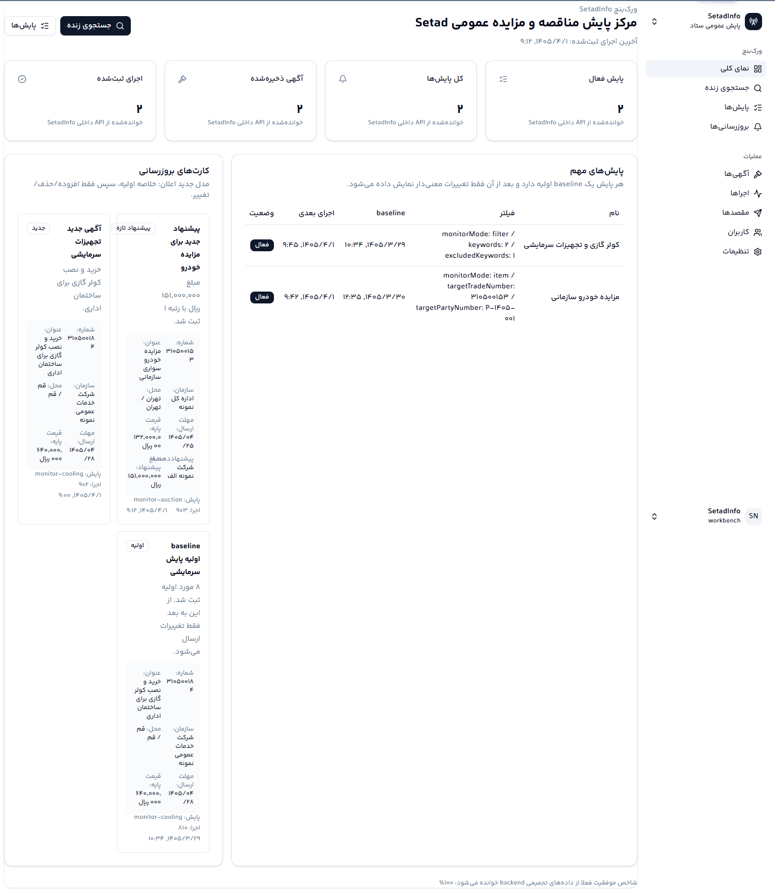
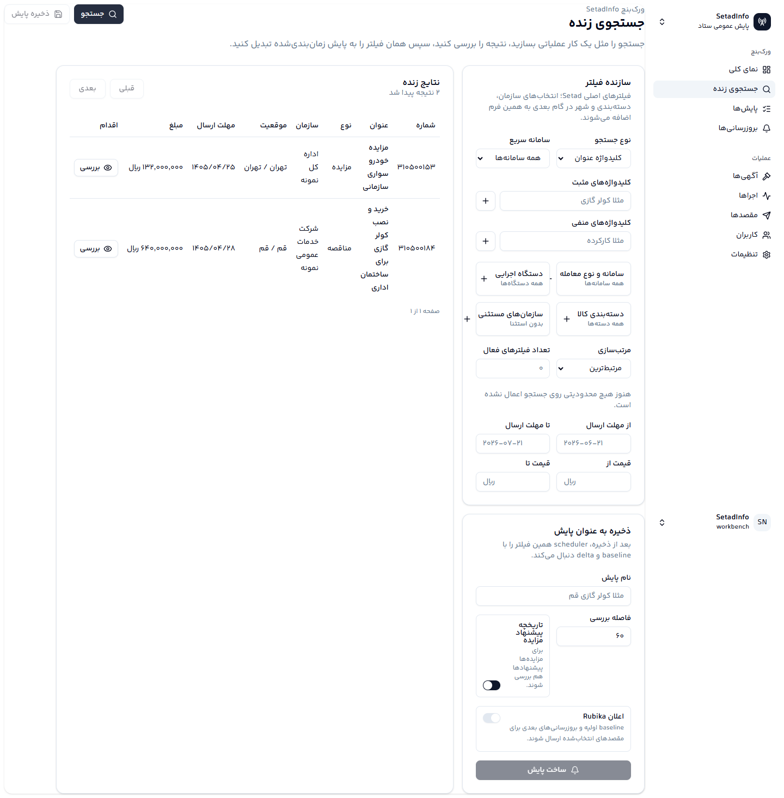
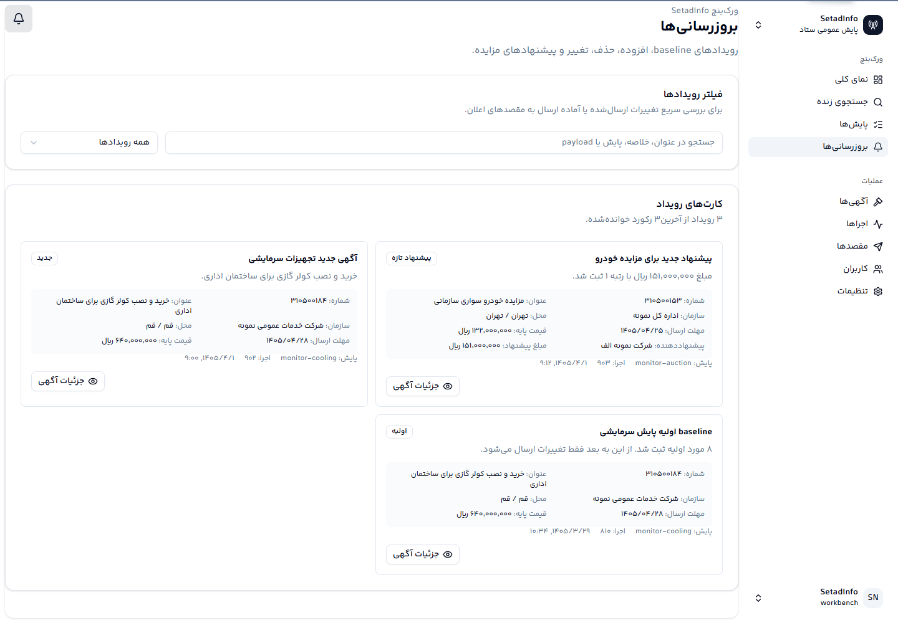
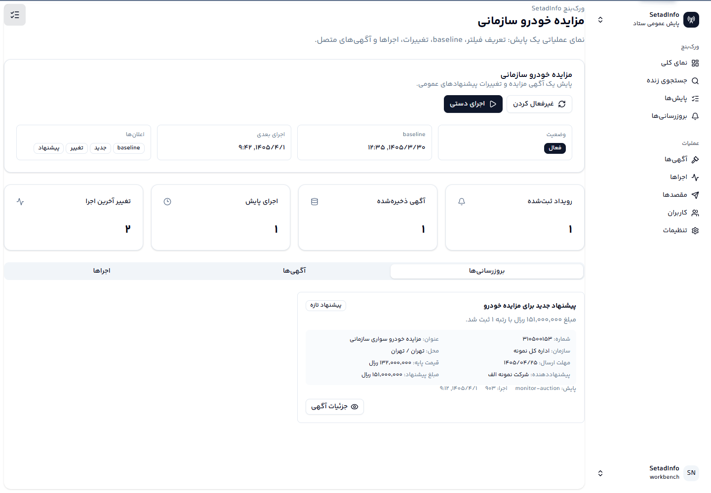
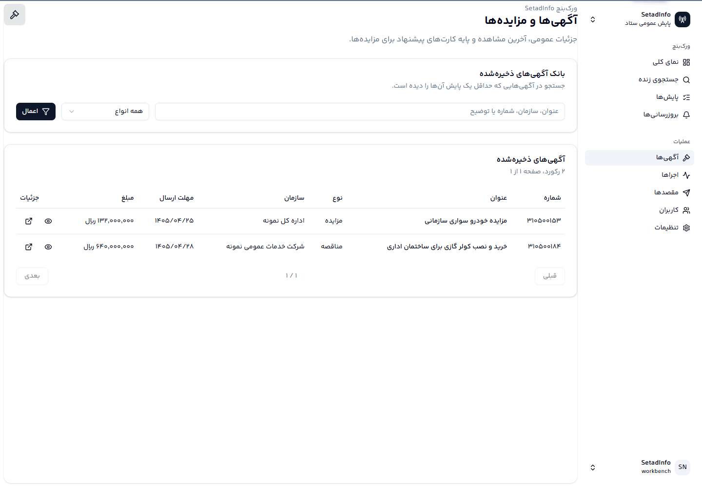

# SetadInfo

SetadInfo یک ورک‌بنچ فارسی و راست‌به‌چپ برای جستجو، پایش و تحلیل آگهی‌های عمومی
سامانه ستاد است. هدف پروژه این است که کاربر به جای بازخوانی دستی آگهی‌ها، یک
جریان کاری روشن داشته باشد: جستجوی دقیق، ساخت پایش، ثبت baseline اولیه، مشاهده
فقط تغییرات بعدی، بررسی پیشنهادهای مزایده و ارسال اعلان‌های قابل فهم.

> این مخزن برای انتشار متن‌باز آماده شده است. هیچ توکن، chat ID، کلید SSH،
> دامپ پایگاه داده، اسکرین‌شات خصوصی یا فایل محیطی واقعی نباید وارد مخزن عمومی
> شود.

## تصویر کلی



SetadInfo یک سایت تک‌صفحه‌ای شلوغ نیست؛ یک داشبورد چندمسیره است که هر مسیر یک
کار واقعی را پوشش می‌دهد:

- `جستجوی زنده`: ساخت فیلتر، بررسی نتیجه و تبدیل همان فیلتر به پایش.
- `پایش‌ها`: مدیریت پایش‌ها، اجرای دستی، فعال/غیرفعال کردن و مشاهده وضعیت.
- `بروزرسانی‌ها`: کارت‌های رویداد برای baseline، آگهی جدید، تغییر آگهی و تغییر
  پیشنهاد.
- `آگهی‌ها`: بانک آگهی‌های ذخیره‌شده با جستجو، فیلتر نوع و جزئیات.
- `اجراها`: تاریخچه scheduler، تعداد دریافت‌شده/مطابق/تغییر و پیام خطا.
- `مقصدها`: مدیریت مقصدهای Rubika برای ارسال اعلان.
- `کاربران`: نقش‌های `admin`، `operator` و `viewer`.

## وضعیت محصول و بازطراحی

این مخزن عمومی نسخه canonical پروژه است. فرانت‌اند فعلی کار می‌کند و به سایت
production وصل شده، اما مسیر بعدی محصول یک بازطراحی کامل تجربه کاربری و رابط
کاربری است. brief اصلی بازطراحی اینجاست:

- [FRONTEND_REDESIGN_BRIEF.md](FRONTEND_REDESIGN_BRIEF.md)

این brief می‌تواند توسط توسعه‌دهنده، طراح، Google AI Studio یا هر ابزار دیگری
استفاده شود؛ هدف، ساخت یک ورک‌بنچ بهتر است، نه وابستگی به ابزار خاص.

## جریان کار اصلی



1. کاربر در `جستجوی زنده` فیلتر را با کلیدواژه، نوع معامله، سامانه، سازمان،
   دسته‌بندی، مهلت‌ها و بازه قیمت می‌سازد.
2. نتیجه همان لحظه از API بک‌اند خوانده می‌شود؛ مرورگر مستقیم به درگاه عمومی
   ستاد وصل نمی‌شود.
3. کاربر می‌تواند یک آگهی خاص را بررسی کند یا همان فیلتر را به پایش زمان‌بندی
   شده تبدیل کند.
4. اولین اجرای موفق baseline را ثبت می‌کند.
5. بعد از baseline، فقط تغییرات معنی‌دار ثبت و ارسال می‌شوند.

## اعلان‌های قابل استفاده



مدل اعلان SetadInfo بر اساس baseline و delta است:

- اجرای اول: ارسال خلاصه اولیه از موارد پیدا شده.
- اجراهای بعدی: فقط افزوده‌ها، حذف‌ها، تغییرهای مهم و پیشنهادهای جدید/تغییریافته.
- هر رویداد به شکل کارت اطلاعاتی ذخیره می‌شود تا کاربر شماره، عنوان، سازمان،
  محل، مهلت، مبلغ و در صورت وجود پیشنهاد مزایده را ببیند.
- مقصدهای Rubika برای هر پایش قابل انتخاب هستند و مقصد غیرفعال در ارسال نادیده
  گرفته می‌شود.

## نمای پایش



صفحه جزئیات پایش پاسخ می‌دهد:

- این پایش دقیقا چه چیزی را دنبال می‌کند؟
- baseline چه زمانی ثبت شده است؟
- آخرین اجرا چه تغییری پیدا کرده است؟
- چه آگهی‌هایی به پایش وصل هستند؟
- کدام رویدادها آماده ارسال یا ارسال‌شده‌اند؟

## بانک آگهی‌ها



آگهی‌های ذخیره‌شده فقط رکوردهایی هستند که حداقل یک پایش آن‌ها را دیده است.
در صفحه آگهی‌ها می‌توان جستجو کرد، نوع معامله را فیلتر کرد، جزئیات آگهی را دید،
لینک عمومی ستاد را باز کرد و در مزایده‌ها پیشنهادهای ذخیره‌شده را بررسی کرد.

## معماری

```text
frontend-workbench  ->  FastAPI API  ->  Setad public gateway
                         |
                         +-> PostgreSQL
                         +-> Redis cache
                         +-> Celery worker/beat
                         +-> Rubika official Bot API
```

اجزای اصلی:

- `backend/`: FastAPI، SQLAlchemy، Celery، Redis، PostgreSQL، کلاینت Setad و
  Rubika.
- `frontend-workbench/`: React، TypeScript، Vite، TanStack Router، React Query،
  shadcn/ui، Radix و Tailwind.
- `deploy/`: نمونه پیکربندی Nginx برای استقرار پشت TLS.
- `docs/`: معماری، استقرار، Rubika، پایداری جستجو و پژوهش API عمومی ستاد.

## اجرای محلی

### بک‌اند

```bash
python -m pip install -r backend/requirements.txt
PYTHONPATH=backend uvicorn app.main:app --host 127.0.0.1 --port 8765
```

### ورک‌بنچ

```bash
cd frontend-workbench
pnpm install
pnpm dev --host 127.0.0.1 --port 5180
```

Vite درخواست‌های `/api` را به `http://127.0.0.1:8765` proxy می‌کند.

## اجرای Docker Compose

ابتدا فایل محیطی بسازید:

```bash
cp .env.example .env
```

سپس مقدارهای حساس را تغییر دهید و سرویس‌ها را بالا بیاورید:

```bash
docker compose config --quiet
docker compose up -d --build
```

برای production، `APP_BASE_URL`، `SECRET_KEY`، `POSTGRES_PASSWORD`،
`ADMIN_PASSWORD` و توکن‌های پیام‌رسان را فقط در محیط سرور نگه دارید.

## آزمون‌ها

```bash
PYTHONPATH=backend python -m unittest discover -s backend/tests -v
cd frontend-workbench
pnpm lint
pnpm build
```

برای ساخت اسکرین‌شات‌های عمومی با داده نمونه:

```bash
cd frontend-workbench
pnpm build
pnpm preview --host 127.0.0.1 --port 5181
WORKBENCH_URL=http://127.0.0.1:5181 node scripts/capture-public-screenshots.mjs
```

## فونت‌ها

نسخه خصوصی می‌تواند از فونت self-hosted فارسی استفاده کند. اگر از فونت تجاری یا
کاربر-فراهم‌شده استفاده می‌کنید، بدون مجوز بازنشر آن را وارد مخزن عمومی نکنید.
متن انگلیسی در ورک‌بنچ با `@fontsource/inter` پشتیبانی می‌شود.

## امنیت و انتشار عمومی

قبل از انتشار یا push عمومی:

- `.env`، `.env.*` واقعی، `.ops-private/`، کلید SSH و certificate private key را
  منتشر نکنید.
- توکن Rubika، chat ID واقعی، لاگ ارسال، دامپ PostgreSQL و اسکرین‌شات مکالمه
  خصوصی را حذف کنید.
- فایل‌های `backend/data/`، `backend/wheelhouse/`، `tmp/` و خروجی‌های build را
  وارد مخزن نکنید.
- `README.md` و اسکرین‌شات‌ها فقط باید داده نمونه یا fake داشته باشند.
- CI باید برای بک‌اند و فرانت‌اند سبز باشد.

## مستندات

- [راهنمای بازطراحی فرانت‌اند](FRONTEND_REDESIGN_BRIEF.md)
- [Roadmap](ROADMAP.md)
- [معماری](docs/architecture.md)
- [استقرار](docs/deployment.md)
- [پایداری جستجوی زنده](docs/live-search-reliability.md)
- [پژوهش API عمومی ستاد](docs/setad-research.md)
- [راه‌اندازی Rubika](docs/rubika-setup.md)
- [چک‌لیست انتشار عمومی](docs/public-release-checklist.md)
- [نمونه GitHub Actions CI](docs/github-actions-ci.example.yml)

## مجوز

این پروژه با مجوز MIT منتشر می‌شود. برای جزئیات، `LICENSE` و `NOTICE` را ببینید.
