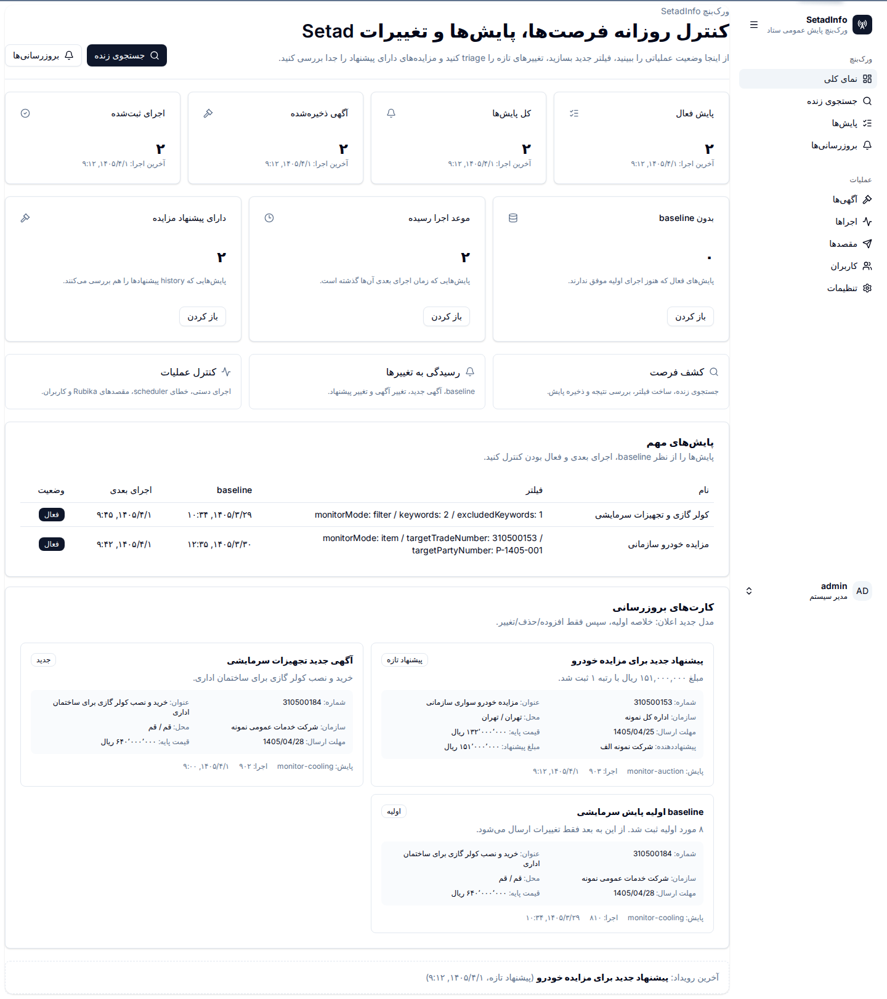
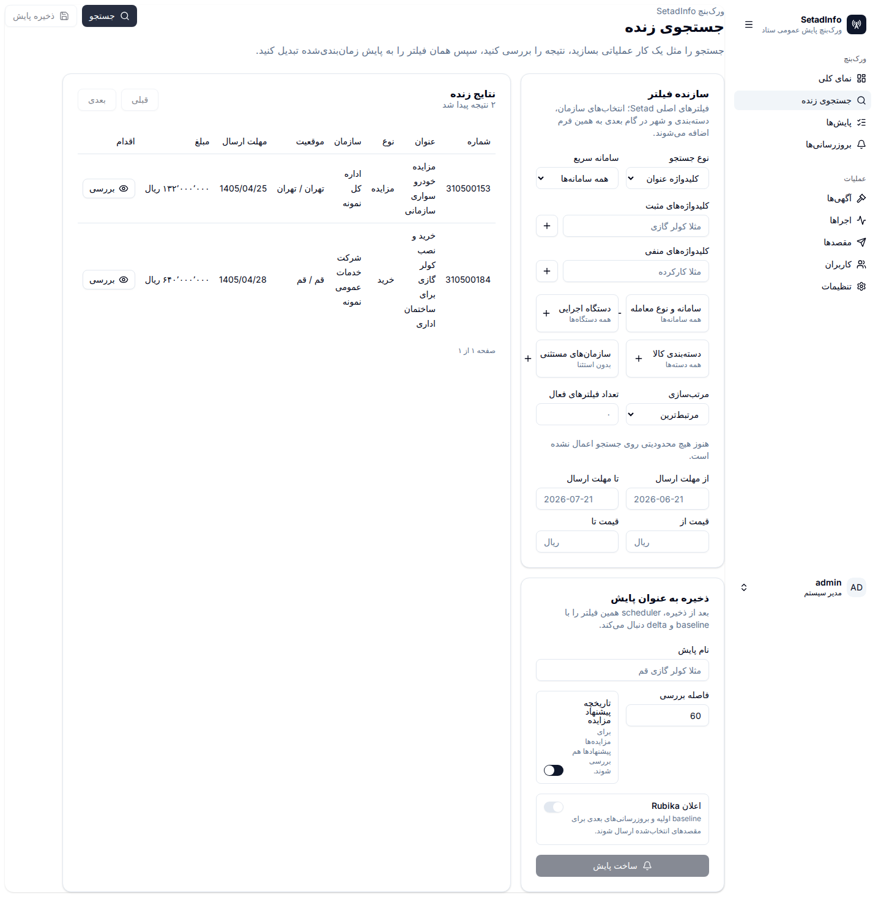
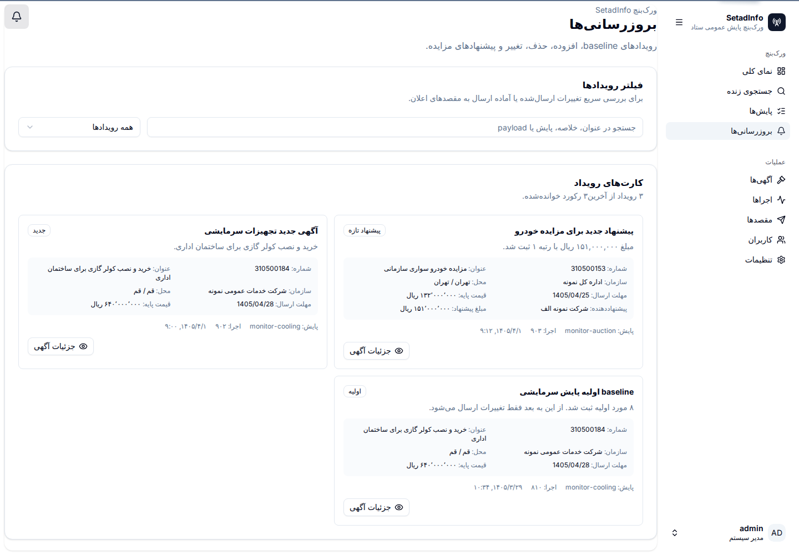
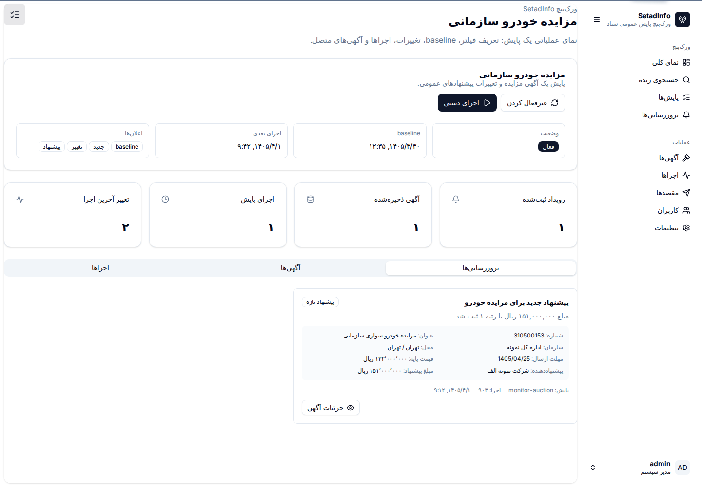
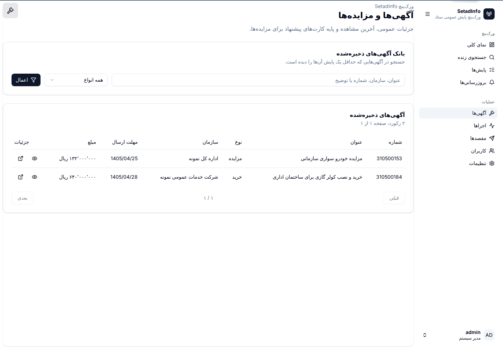

# SetadInfo

[](https://github.com/moroshani/setadinfo/actions/workflows/ci.yml)
[](https://github.com/moroshani/setadinfo/actions/workflows/codeql.yml)
[](LICENSE)


**[آزمایش نسخه نمایشی عمومی](https://moroshani.github.io/setadinfo/)**

> وضعیت: پروژه در حال توسعه فعال است. نسخه نمایشی عمومی فقط داده ساختگی دارد و
> استقرار عملیاتی خصوصی به عنوان سرویس عمومی معرفی نمی‌شود.

SetadInfo یک ورک‌بنچ فارسی و راست‌به‌چپ برای جستجو، پایش و تحلیل آگهی‌های عمومی
سامانه ستاد است. هدف پروژه این است که کاربر به جای بازخوانی دستی آگهی‌ها، یک
جریان کاری روشن داشته باشد: جستجوی دقیق، ساخت پایش، ثبت لیست اولیه، مشاهده
فقط تغییرات بعدی، بررسی پیشنهادهای مزایده و ارسال اعلان‌های قابل فهم.

> این مخزن برای انتشار متن‌باز آماده شده است. هیچ توکن، chat ID، کلید SSH،
> دامپ پایگاه داده، اسکرین‌شات خصوصی یا فایل محیطی واقعی نباید وارد مخزن عمومی
> شود.

## نسخه نمایشی عمومی

نسخه آنلاین روی GitHub Pages جریان‌های اصلی محصول را با داده کاملا ساختگی نشان
می‌دهد. این build در مرورگر اجرا می‌شود، mutationها را فقط در حافظه نگه می‌دارد
و هیچ درخواست مستقیمی به `/api`، Setad یا Rubika نمی‌فرستد. داده نمونه full-stack
برای توسعه محلی مسیر جداگانه‌ای دارد که در
[راهنمای داده نمایشی](docs/demo-data.md) توضیح داده شده است.

## تصویر کلی



SetadInfo یک سایت تک‌صفحه‌ای شلوغ نیست؛ یک داشبورد چندمسیره است که هر مسیر یک
کار واقعی را پوشش می‌دهد:

- `جستجوی زنده`: ساخت فیلتر، بررسی نتیجه و تبدیل همان فیلتر به پایش.
- `پایش‌ها`: مدیریت پایش‌ها، اجرای دستی، فعال/غیرفعال کردن و مشاهده وضعیت.
- `بروزرسانی‌ها`: کارت‌های رویداد برای لیست اولیه، آگهی جدید، تغییر آگهی و تغییر
  پیشنهاد.
- `آگهی‌ها`: بانک آگهی‌های ذخیره‌شده با جستجو، فیلتر نوع و جزئیات.
- `اجراها`: تاریخچه scheduler، تعداد دریافت‌شده/مطابق/تغییر و پیام خطا.
- `مقصدها`: مدیریت مقصدهای Rubika برای ارسال اعلان.
- `کاربران`: نقش‌های `admin`، `operator` و `viewer`.

## وضعیت محصول و بازطراحی

این مخزن عمومی نسخه canonical پروژه است. فرانت‌اند فعلی کار می‌کند و به سایت
production وصل شده، اما مسیر بعدی محصول یک بازطراحی کامل تجربه کاربری و رابط
کاربری است. brief اصلی بازطراحی اینجاست:

- [FRONTEND_REDESIGN_BRIEF.md](FRONTEND_REDESIGN_BRIEF.md)

این brief می‌تواند توسط توسعه‌دهنده، طراح، Google AI Studio یا هر ابزار دیگری
استفاده شود؛ هدف، ساخت یک ورک‌بنچ بهتر است، نه وابستگی به ابزار خاص.

جریان‌های کاری که بازطراحی باید پوشش دهد در
[جریان‌های اصلی محصول](docs/product-workflows.md) مستند شده‌اند.

## جریان کار اصلی



1. کاربر در `جستجوی زنده` فیلتر را با کلیدواژه، نوع معامله، سامانه، سازمان،
   دسته‌بندی، مهلت‌ها و بازه قیمت می‌سازد.
2. نتیجه همان لحظه از API بک‌اند خوانده می‌شود؛ مرورگر مستقیم به درگاه عمومی
   ستاد وصل نمی‌شود.
3. کاربر می‌تواند یک آگهی خاص را بررسی کند یا همان فیلتر را به پایش زمان‌بندی
   شده تبدیل کند.
4. اولین اجرای موفق لیست اولیه را ثبت می‌کند.
5. بعد از لیست اولیه، فقط تغییرات معنی‌دار ثبت و ارسال می‌شوند.

## اعلان‌های قابل استفاده



مدل اعلان SetadInfo بر اساس لیست اولیه و تغییر جدید است:

- اجرای اول: ارسال یک خلاصه از لیست اولیه، نه یک پیام برای هر مورد.
- اجراهای بعدی: فقط افزوده‌ها، خروج از نتایج، تغییرهای مهم و پیشنهادهای جدید/تغییریافته.
- هر پیام دلیل ارسال دارد و برای تغییرها مقدار قبل/بعد را نشان می‌دهد.
- اجرای زمان‌بندی‌شده بدون تغییر، پیام جدید نمی‌فرستد.
- مقصدهای Rubika برای هر پایش قابل انتخاب هستند و مقصد غیرفعال در ارسال نادیده
  گرفته می‌شود.

## نمای پایش



صفحه جزئیات پایش پاسخ می‌دهد:

- این پایش دقیقا چه چیزی را دنبال می‌کند؟
- لیست اولیه چه زمانی ثبت شده است؟
- آخرین اجرا چه تغییری پیدا کرده است؟
- چه آگهی‌هایی به پایش وصل هستند؟
- کدام رویدادها آماده ارسال یا ارسال‌شده‌اند؟

## بانک آگهی‌ها



آگهی‌های ذخیره‌شده فقط رکوردهایی هستند که حداقل یک پایش آن‌ها را دیده است.
در صفحه آگهی‌ها می‌توان جستجو کرد، نوع معامله را فیلتر کرد، جزئیات آگهی را دید،
لینک عمومی ستاد را باز کرد و در مزایده‌ها پیشنهادهای ذخیره‌شده را بررسی کرد.

## معماری

```text
frontend-workbench  ->  FastAPI API  ->  Setad public gateway
                         |
                         +-> PostgreSQL
                         +-> Redis cache
                         +-> Celery worker/beat
                         +-> Rubika official Bot API
```

اجزای اصلی:

- `backend/`: FastAPI، SQLAlchemy، Celery، Redis، PostgreSQL، کلاینت Setad و
  Rubika.
- `frontend-workbench/`: React، TypeScript، Vite، TanStack Router، React Query،
  shadcn/ui، Radix و Tailwind.
- `deploy/`: نمونه پیکربندی Nginx برای استقرار پشت TLS.
- `docs/`: معماری، استقرار، Rubika، پایداری جستجو و پژوهش API عمومی ستاد.

## اجرای محلی

### بک‌اند

```bash
python -m pip install -r backend/requirements.txt
PYTHONPATH=backend uvicorn app.main:app --host 127.0.0.1 --port 8765
```

### ورک‌بنچ

```bash
cd frontend-workbench
pnpm install
pnpm dev --host 127.0.0.1 --port 5180
```

Vite درخواست‌های `/api` را به `http://127.0.0.1:8765` proxy می‌کند.

## اجرای Docker Compose

ابتدا فایل محیطی بسازید:

```bash
cp .env.example .env
```

سپس مقدارهای حساس را تغییر دهید و سرویس‌ها را بالا بیاورید:

```bash
docker compose config --quiet
docker compose up -d --build
```

برای production، `APP_BASE_URL`، `SECRET_KEY`، `POSTGRES_PASSWORD`،
`ADMIN_PASSWORD` و توکن‌های پیام‌رسان را فقط در محیط سرور نگه دارید.

## آزمون‌ها

```bash
PYTHONPATH=backend python -m unittest discover -s backend/tests -v
cd frontend-workbench
corepack enable
pnpm install --frozen-lockfile
pnpm lint
pnpm test
pnpm build
```

## مهاجرت پایگاه داده

برای پایگاه داده تازه:

```bash
alembic -c alembic.ini upgrade head
```

برای پایگاه داده موجود، ابتدا backup بگیرید و اگر schema فعلی از قبل وجود دارد
از `stamp head` استفاده کنید. جزئیات در
[مهاجرت پایگاه داده](docs/migrations.md) آمده است.

## داده نمونه برای بازبینی UI/UX

برای اینکه طراح یا ابزارهای بازطراحی بتوانند بدون اتصال به Setad و Rubika همه
مسیرهای مهم را ببینند، داده نمونه محلی آماده شده است:

```bash
PYTHONPATH=backend python -m scripts.seed_demo --yes
```

جزئیات ورود نمونه و محتوای ساخته‌شده در
[داده نمونه برای بازبینی محصول](docs/demo-data.md) آمده است.

برای بازبینی تصویری عمومی، ورک‌بنچ build شده را با داده نمونه در مرورگر باز
کنید و فقط از داده fake یا نمونه استفاده کنید.

## فونت‌ها

نسخه خصوصی می‌تواند از فونت self-hosted فارسی استفاده کند. اگر از فونت تجاری یا
کاربر-فراهم‌شده استفاده می‌کنید، بدون مجوز بازنشر آن را وارد مخزن عمومی نکنید.
متن انگلیسی در ورک‌بنچ با `@fontsource/inter` پشتیبانی می‌شود.

## امنیت و انتشار عمومی

قبل از انتشار یا push عمومی:

- `.env`، `.env.*` واقعی، `.ops-private/`، کلید SSH و certificate private key را
  منتشر نکنید.
- توکن Rubika، chat ID واقعی، لاگ ارسال، دامپ PostgreSQL و اسکرین‌شات مکالمه
  خصوصی را حذف کنید.
- فایل‌های `backend/data/`، `backend/wheelhouse/`، `tmp/` و خروجی‌های build را
  وارد مخزن نکنید.
- `README.md` و اسکرین‌شات‌ها فقط باید داده نمونه یا fake داشته باشند.
- CI باید برای بک‌اند و فرانت‌اند سبز باشد.

## مستندات

- [نمایه مستندات و وضعیت این checkout](docs/README.md)
- [Changelog](CHANGELOG.md)
- [Support](SUPPORT.md)
- [راهنمای بازطراحی فرانت‌اند](FRONTEND_REDESIGN_BRIEF.md)
- [Roadmap](ROADMAP.md)
- [Product redesign plan](docs/product-redesign-plan.md)
- [قرارداد API فرانت‌اند](docs/api-contract.md)
- [سیاست اعلان‌ها](docs/notification-policy.md)
- [Runbook عملیات](docs/operations-runbook.md)
- [مهاجرت پایگاه داده](docs/migrations.md)
- [معماری](docs/architecture.md)
- [استقرار](docs/deployment.md)
- [پایداری جستجوی زنده](docs/live-search-reliability.md)
- [پژوهش API عمومی ستاد](docs/setad-research.md)
- [راه‌اندازی Rubika](docs/rubika-setup.md)
- [چک‌لیست انتشار عمومی](docs/public-release-checklist.md)
- [نمونه GitHub Actions CI](docs/github-actions-ci.example.yml)

## مجوز

این پروژه با مجوز MIT منتشر می‌شود. برای جزئیات، `LICENSE` و `NOTICE` را ببینید.
